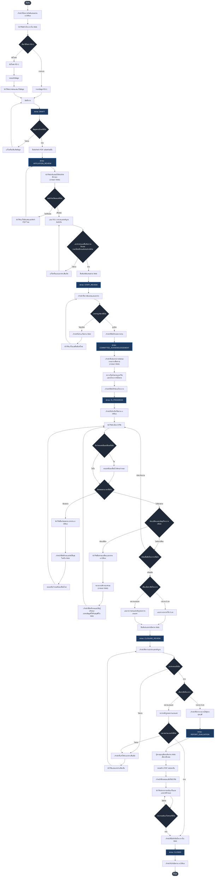

# Workflow

## ระบบบริหารจัดการทุนวิจัยส่วนตัว มหาวิทยาลัยแม่ฟ้าหลวง

```mermaid
flowchart TD
    START([เริ่มต้น])
    A["เจ้าหน้าที่ประกาศรับข้อเสนอผ่าน e-Office"]
    B["นักวิจัยสร้างโครงการใน Web"]
    C{"เลือกวิธีจัดทำ RS-1"}
    D["กรอกข้อมูล RS-1"]
    E["อัปโหลด RS-1"]
    F["ระบบสกัดข้อมูล"]
    G["นักวิจัยตรวจสอบและแก้ไขข้อมูล"]
    H["บันทึกร่าง"]
    S1["สถานะ: DRAFT"]
    I{"ข้อมูลครบถ้วนหรือไม่"}
    J["แก้ไขหรือเพิ่มเติมข้อมูล"]
    K["ยืนยันจัดทำ PDF ฉบับพร้อมยื่น"]

    S2["สถานะ: AFFILIATION_REVIEW"]
    L["นักวิจัยนำข้อเสนอให้ต้นสังกัดพิจารณา<br/>(ภายนอก Web)"]
    M{"ต้นสังกัดเห็นชอบหรือไม่"}
    N["นักวิจัยแก้ไขข้อเสนอและจัดทำ PDF ใหม่"]
    O["แนบ RS-1 ลงนามและหลักฐานต้นสังกัด"]
    P{"เอกสารครบและยืนยันความยินยอม<br/>ลายเซ็นอิเล็กทรอนิกส์แล้วหรือไม่"}
    Q["แก้ไขหรือแนบเอกสารเพิ่มเติม"]
    R["ยืนยันส่งข้อเสนอผ่าน Web"]

    S3["สถานะ: STAFF_REVIEW"]
    T["เจ้าหน้าที่ตรวจข้อเสนอและเอกสาร"]
    U{"เอกสารถูกต้องหรือไม่"}
    V["เจ้าหน้าที่แจ้งแก้ไขผ่าน Web"]
    W["นักวิจัยแก้ไขและยืนยันส่งใหม่"]
    X["เจ้าหน้าที่บันทึกผลตรวจผ่าน"]

    S4["สถานะ: COMMITTEE_ACKNOWLEDGEMENT"]
    Y["เจ้าหน้าที่เสนอรายการต่อคณะกรรมการเพื่อทราบ<br/>(ภายนอก Web)"]
    Z["ตรวจเงื่อนไขมาตรฐานวิจัย<br/>เฉพาะโครงการที่เข้าข่าย"]
    AA["เจ้าหน้าที่บันทึกรับรองโครงการ"]

    S5["สถานะ: IN_PROGRESS"]
    AB["เจ้าหน้าที่แจ้งเริ่มวิจัยผ่าน e-Office"]
    AC["นักวิจัยดำเนินการวิจัย"]
    AD{"ถึงกำหนดส่งอีเมลเตือนหรือไม่"}
    AE["ระบบส่งอีเมลเตือนใกล้ครบกำหนด"]
    AF{"ต้องขอขยายเวลาหรือไม่"}
    AG["นักวิจัยยื่นคำขอขยายเวลาผ่าน e-Office"]
    AH["เจ้าหน้าที่บันทึกผลและวันสิ้นสุดใหม่ใน Web"]
    AI["ระบบปรับกำหนดอีเมลเตือนใหม่"]
    AJ{"ต้องเปลี่ยนแปลงข้อมูลโครงการหรือไม่"}
    AK["นักวิจัยยื่นคำขอเปลี่ยนแปลงผ่าน e-Office"]
    AL["หน่วยงานพิจารณาคำขอ<br/>(ภายนอก Web)"]
    AM["เจ้าหน้าที่บันทึกผลและเป็นผู้ปรับปรุง<br/>เฉพาะข้อมูลที่ได้รับอนุมัติใน Web"]
    AN{"พร้อมยื่นปิดโครงการหรือไม่"}
    AO{"เลือกเส้นทางปิดโครงการ"}
    AP["แนบร่างรายงานวิจัย 5 บท"]
    AQ["แนบรายงานย่อและหลักฐานผลงานเผยแพร่"]
    AR["ยืนยันส่งเอกสารปิดผ่าน Web"]

    S6["สถานะ: CLOSURE_REVIEW"]
    AS["เจ้าหน้าที่ตรวจเอกสารและหลักฐาน"]
    AT{"เอกสารครบหรือไม่"}
    AU["เจ้าหน้าที่แจ้งให้ส่งเอกสารเพิ่มเติม"]
    AV["นักวิจัยแนบเอกสารเพิ่มเติม"]
    AW{"เส้นทางปิดโครงการ"}
    AX["ตรวจหลักฐานผลงานเผยแพร่"]
    AY{"ผลงานผ่านเกณฑ์หรือไม่"}
    AZ["เจ้าหน้าที่ส่งร่างรายงานให้ผู้ทรงคุณวุฒิ"]

    S7["สถานะ: REPORT_EVALUATION"]
    BA["ผู้ทรงคุณวุฒิประเมินผ่าน Web เพียงหนึ่งรอบ"]
    BB["ระบบสร้าง PDF ผลประเมิน"]
    BC["เจ้าหน้าที่ส่งผลประเมินให้นักวิจัย"]
    BD["นักวิจัยส่งรายงานฉบับแก้ไขและเอกสารที่กำหนด"]
    BE{"รายงานฉบับแก้ไขครบหรือไม่"}

    BF["เจ้าหน้าที่บันทึกปิดโครงการใน Web"]
    S8["สถานะ: CLOSED"]
    BG["เจ้าหน้าที่แจ้งปิดผ่าน e-Office"]
    END([สิ้นสุด])

    START --> A --> B --> C
    C -->|กรอกเอง| D --> H
    C -->|อัปโหลด| E --> F --> G --> H
    H --> S1 --> I
    I -->|ไม่ครบ| J --> H
    I -->|ครบ| K --> S2

    S2 --> L --> M
    M -->|ไม่เห็นชอบ| N --> S2
    M -->|เห็นชอบ| O --> P
    P -->|ไม่ครบ| Q --> O
    P -->|ครบ| R --> S3

    S3 --> T --> U
    U -->|ไม่ถูกต้อง| V --> W --> T
    U -->|ถูกต้อง| X --> S4
    S4 --> Y --> Z --> AA --> S5

    S5 --> AB --> AC --> AD
    AD -->|ใช่| AE --> AF
    AD -->|ไม่ใช่| AF
    AF -->|ต้องขยาย| AG --> AH --> AI --> AC
    AF -->|ไม่ต้องขยาย| AJ
    AJ -->|ต้องเปลี่ยน| AK --> AL --> AM --> AC
    AJ -->|ไม่ต้องเปลี่ยน| AN
    AN -->|ยังดำเนินงาน| AC
    AN -->|พร้อมปิด| AO

    AO -->|รายงาน 5 บท| AP --> AR
    AO -->|ผลงานเผยแพร่| AQ --> AR
    AR --> S6 --> AS --> AT
    AT -->|ไม่ครบ| AU --> AV --> AS
    AT -->|ครบ| AW

    AW -->|ผลงานเผยแพร่| AX --> AY
    AY -->|ไม่ผ่าน| AU
    AY -->|ผ่าน| BF
    AW -->|รายงาน 5 บท| AZ --> S7 --> BA --> BB --> BC --> BD --> BE
    BE -->|ไม่ครบ| BD
    BE -->|ครบ| BF
    BF --> S8 --> BG --> END

    classDef activity fill:#111827,stroke:#9ca3af,color:#ffffff
    classDef decision fill:#1f2937,stroke:#d1d5db,color:#ffffff
    classDef status fill:#1e3a5f,stroke:#60a5fa,color:#ffffff,stroke-width:2px
    classDef terminal fill:#374151,stroke:#e5e7eb,color:#ffffff

    class S1,S2,S3,S4,S5,S6,S7,S8 status
    class C,I,M,P,U,AD,AF,AJ,AN,AO,AT,AW,AY,BE decision
    class START,END terminal
```

> การขยายเวลาและการเปลี่ยนแปลงข้อมูลโครงการเป็นเหตุการณ์ภายใน `IN_PROGRESS` จึงไม่สร้างสถานะหลักใหม่
